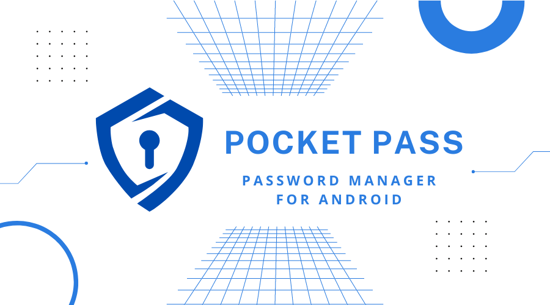

# Pocket Pass 
   

Pocket Pass is a simple and secure password manager app. which lets you store your password in local database with encryption. And autofill whenever you need.

<a href="https://play.google.com/store/apps/details?id=com.nide.pocketpass">
  
</a>

       

## Build With 🛠
- [Kotlin](https://google.com) - this project is completely build on Kotlin , offical language for Android.
- [Clean Architecture](https://www.freecodecamp.org/news/a-quick-introduction-to-clean-architecture-990c014448d2/) - This app flow the Principal of Clean Architecture.
- [Hilt](https://dagger.dev/hilt/) - for dependency injection.
- [Room](https://developer.android.com/jetpack/androidx/releases/room?gclid=Cj0KCQjwkt6aBhDKARIsAAyeLJ39QhITAKO-jlSBVwrp2fqlG2yzBzPvJK00MsS3nygG3TCV1YSf4q8aAuzsEALw_wcB&gclsrc=aw.ds) - for local database.and store passwords into locally.
- [DataStore](https://developer.android.com/topic/libraries/architecture/datastore?gclid=Cj0KCQjwkt6aBhDKARIsAAyeLJ3kfP7oT0NoISnt5NEREpTuN52FRBt1kmNL3vJAfeWwgFHvniPgF8MaAldaEALw_wcB&gclsrc=aw.ds) - for storeing small meta data into local device.
- [Single Activity architecture](https://developer.android.com/guide/navigation/navigation-migrate) -  for better optimization. 
- [Coroutines](https://kotlinlang.org/docs/reference/coroutines-overview.html) - for asynchronous work.
- [ViewModel](https://developer.android.com/topic/libraries/architecture/viewmodel) - to  prevent android process death , store data separate from view lifecycle.
- [Flow](https://kotlinlang.org/api/kotlinx.coroutines/kotlinx-coroutines-core/kotlinx.coroutines.flow/-flow/) - for store and retrive stream data.
- [GSON](https://github.com/google/gson) - is user to convert object into string and retrive object from string.
- [Firebase Auth](https://firebase.google.com/products/auth?gclid=Cj0KCQjwkt6aBhDKARIsAAyeLJ1MT27NyP_1nR_jY5JcE14bxIP6aWfDxmAMScooSQYdeofzbZIjNX4aAvZTEALw_wcB&gclsrc=aw.ds) - to Authorization , login and register into app.
- [Firebase Firestore](https://firebase.google.com/products/firestore?gclid=Cj0KCQjwkt6aBhDKARIsAAyeLJ08chsNsSdKc0VBqK-vUrj22ZrJ30pHKfpbuh5DL0k-FNCc7JRzAIsaAqUNEALw_wcB&gclsrc=aw.ds) - for database. To store user Data.
- [Glide](https://github.com/bumptech/glide) - for image loading.

- **Other libraries**
- [Country code picker](https://github.com/hbb20/CountryCodePickerProject) - for country code picker dialoge.
- [CircularProgressBar](https://github.com/lopspower/CircularProgressBar) - for a cotome circular progressbar.
## Features

- save password or account
- Genarate secure password
- Auto fill 
- Encrypt password
- Check password strength

## License
```
MIT License

Copyright (c) 2022 Debashis

Permission is hereby granted, free of charge, to any person obtaining a copy
of this software and associated documentation files (the "Software"), to deal
in the Software without restriction, including without limitation the rights
to use, copy, modify, merge, publish, distribute, sublicense, and/or sell
copies of the Software, and to permit persons to whom the Software is
furnished to do so, subject to the following conditions:

The above copyright notice and this permission notice shall be included in all
copies or substantial portions of the Software.

THE SOFTWARE IS PROVIDED "AS IS", WITHOUT WARRANTY OF ANY KIND, EXPRESS OR
IMPLIED, INCLUDING BUT NOT LIMITED TO THE WARRANTIES OF MERCHANTABILITY,
FITNESS FOR A PARTICULAR PURPOSE AND NONINFRINGEMENT. IN NO EVENT SHALL THE
AUTHORS OR COPYRIGHT HOLDERS BE LIABLE FOR ANY CLAIM, DAMAGES OR OTHER
LIABILITY, WHETHER IN AN ACTION OF CONTRACT, TORT OR OTHERWISE, ARISING FROM,
OUT OF OR IN CONNECTION WITH THE SOFTWARE OR THE USE OR OTHER DEALINGS IN THE
SOFTWARE.
```
